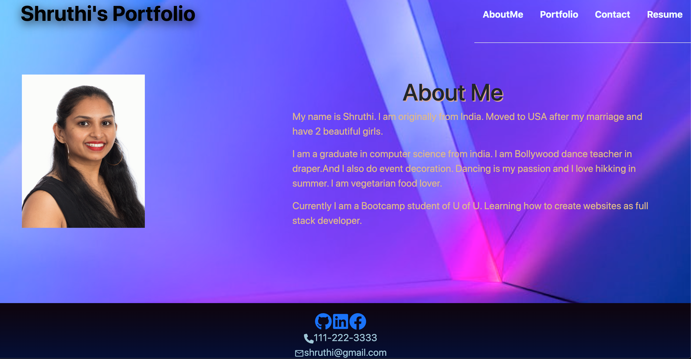

# Portfolio (REACT) 

## Description
    As an Full Stack Web Developer and a member of the dev community, this Portfolio is created using React along with the latest technologies to feature a collection of the best projects I have developed so far, So that I can showcase my professional value in a competitive way to employers.

    ## Tables of content:
  * [Installation](#installation)
  * [Usage](#usage)
  * [Features](#features)
  * [License](#license)
  * [Contributors](#contributors)
  * [Test](#test)
  * [Questions](#questions)

  ## Installation
    1. This portfolio application is developed using React.
    2. Getting Started with Create React App.
        This project was bootstrapped with [Create React App].[npx create-react-app <app-name>]
    3. Available Scripts
        In the project directory, you can run:
            1. `npm start`
    4. This Runs the app in the development mode.
        Open (http://localhost:3000) to view it in your browser.
    5. The page will reload when you make edits.
        You may also see any lint errors in the console.
    6. `npm run build`
         Builds the app for production to the `build` folder.
         It correctly bundles React in production mode and optimizes the build for the best performance.
    7. The build is minified and the filenames include the hashes.
        Your app is ready to be deployed!
    8. See the section about [deployment](https://facebook.github.io/   create-react-app/docs/deployment) for more information.
    9. You can learn more in the [Create React App documentation](https://facebook.github.io/create-react-app/docs/getting-started).
    10. To learn React, check out the [React documentation](https://reactjs.org/).

## Usage 
    1. This portfolio application has been created with React deployed using Github pages.
    2. This portfolio features relevant technologies such as JavaScript, HTML,   CSS, Express, Nodejs, React,Bootstrap and polished UI interfaces.
    3. Every featured project presents a brief description, icons to see the live application and the Github repository and also details button to show details of the project.
    4. The footer includes links to my main internet handles on Github, LinkedIn, facebook and contact number and email.
    3. GIVEN a single-page application portfolio for a web developer
        WHEN I load the portfolio
        THEN I am presented with a page containing a header, a section for content, and a footer.
    4. WHEN I view the header
        THEN I am presented with the developer's name and navigation with titles corresponding to different sections of the portfolio
    5. WHEN I view the navigation titles
        THEN I am presented with the titles About Me, Portfolio, Contact, and Resume, and the title corresponding to the current section is highlighted
    6. WHEN I click on a navigation title
        THEN I am presented with the corresponding section below the navigation without the page reloading and that title is highlighted
    7. WHEN I load the portfolio the first time
        THEN the About Me title and section are selected by default
    8. WHEN I am presented with the About Me section
        THEN I see a recent photo or avatar of the developer and a short bio about them
    9. WHEN I am presented with the Portfolio section
        THEN I see titled images of six of the developer’s applications with links to both the deployed applications and the corresponding GitHub repositories
    10. WHEN I am presented with the Contact section
        THEN I see a contact form with fields for a name, an email address, and a message
    11. WHEN I move my cursor out of one of the form fields without entering text
        THEN I receive a notification that this field is required
    12. WHEN I enter text into the email address field
         THEN I receive a notification if I have entered an invalid email address
    13. WHEN I am presented with the Resume section
         THEN I see a link to a downloadable resume and a list of the developer’s proficiencies
    14. WHEN I view the footer
         THEN I am presented with text or icon links to the developer’s GitHub and LinkedIn profiles, and their profile on a third platform (facebook).

## Features
    1. Used create-react-app to build this portfolio app, which includes the following:
        1. A single Header component that appears on multiple pages
        2. A single Navigation component within the header that will be used to conditionally render the different sections of your portfolio
        3. A single Project component that will be used multiple times in the Portfolio section
        4. A single Footer component that appears on multiple pages
    2. Projects
        For each project that is featured in this portfolio, include the following:
            1. An image of the deployed application (either a short animated GIF or screenshot)
            2. The title of the project
            3. A link to the deployed application
            4. A link to the corresponding GitHub repository
    3. Design:
        1. Used mobile-first design.
        2. Choosed a color palette that distinguishes the site from the default Bootstrap theme and unstyled HTML sites. 
        3. The font size is large enough to read and that the colors don't cause eye strain.
        4. Used React component libraries. 
    
## License  
* This application is licensed under : 
* Click the link for the detailed license information: https://choosealicense.com/licenses/isc/

## Contributors
shruthi

## Test
npm test

## Questions
  * GitHub Username : shruthisalimath
  * Email: shruthi@test.com
  * GitHub profile : https://github.com/shruthisalimath 

## Mock Up
    

## ScreenShot
    

## URL
    1. URL of the functional, deployed application.

    2. URL of the GitHub repository.
    https://github.com/shruthisalimath/Shruthi-Portfolio-React

